# ROOF GENERATOR

Asset Roof generator is made in Houdini program, which is then imported into Unreal Engine
using a special Bridge between these programs. The main work of this tool is to generate tiles
on the geometry supplied to it. It has certain settings with which you can control different
parameters, sizes, rotations, thicknesses, indents, number of elements.
____________________________________________________________________________
To start working with our Roof Generator tool, you must first copy the Houdini Engine bridge
program of the required version to the Plugins folder in UnrealEngin. You can get it in two ways:
1. When installing the Houdini program, you must check the box to install this bridge on your
PC. When installing the program, this bridge will be located along the path:
`C:\Program Files\Side Effects Software\Houdini version.x.xxx\engine\unreal\your-version`
The contents of the version you need must be copied to the Plugin folder along the path where
you have Unreal Engine installed. My path looks like this:
`C:\Program Files\Epic Games\UE_5.3\Engine\Plugins`

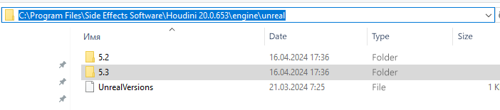

2. You can download the plugin from the official SideFX website.
____________________________________________________________________________

## First steps in Unreal Engine.

When you first start a project, you need to make sure that you have the Houdini Engine menu in
the top menu of the screen.

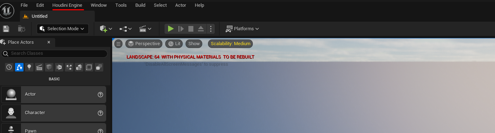

This is the first sign that you did everything correctly and the plugin version matches the UE
version.

---

Next, you need to go to the Houdini Engine menu and start the session.

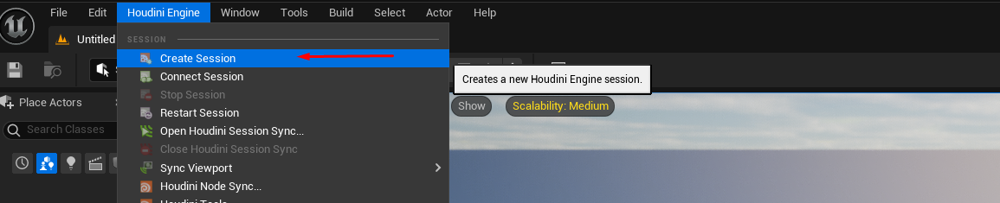

As a sign that everything went well and the session started, you will see a message in the lower
right corner of the screen.

This completes our preliminary work.

## UNREAL ENGINE

----

Import assets into Unreal Engine.
We import the Roof Generator asset via the File menu or simply drag the Roof generator asset
itself into the Unreal Engine to the desired folder.
To start working with the Roof generator, we simply need to drag the asset from the content
browser to the viewport.

1 - In order to be able to assign an asset to a custom (user geometry), we need to select several
important settings.

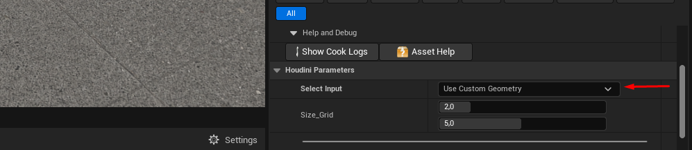

2 - First, you need to switch the parameter to World Input and to start selecting geometry, click
on Start Selection and select geometry in the viewport.

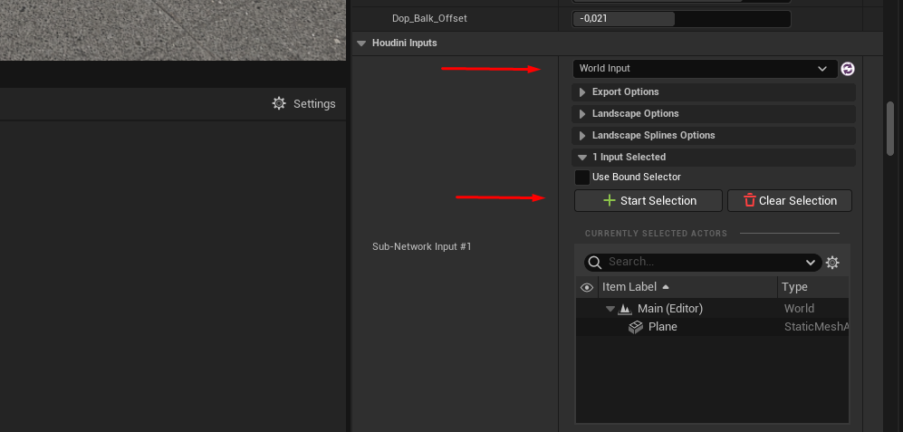

The asset has 3 slots for 3 types of materials. One material goes to the beams, the second
material goes to the tiles themselves, and the third material is assigned to the bottom layer - the
substrate on which the tiles are distributed.

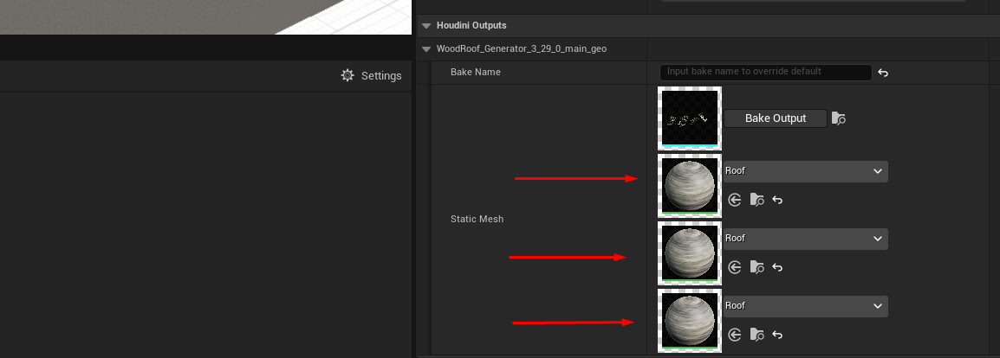

Finally, when the roof appearance is set up, we need to fix the result of the work. To do this,
click Bake, then static geometry is created, which can no longer be changed.

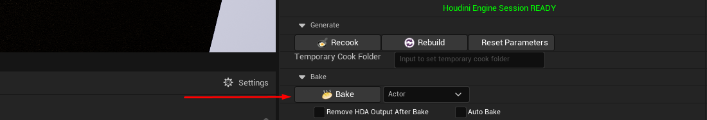

---

An example of using the tool in Unreal Engine.
For example: we have two houses for which we need to generate a roof with tiles.

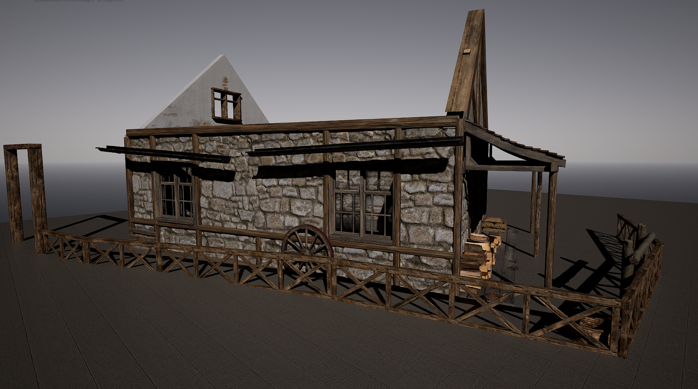

The most convenient way would be to take Grid in UE and place them on the houses where you
plan to generate tiles.

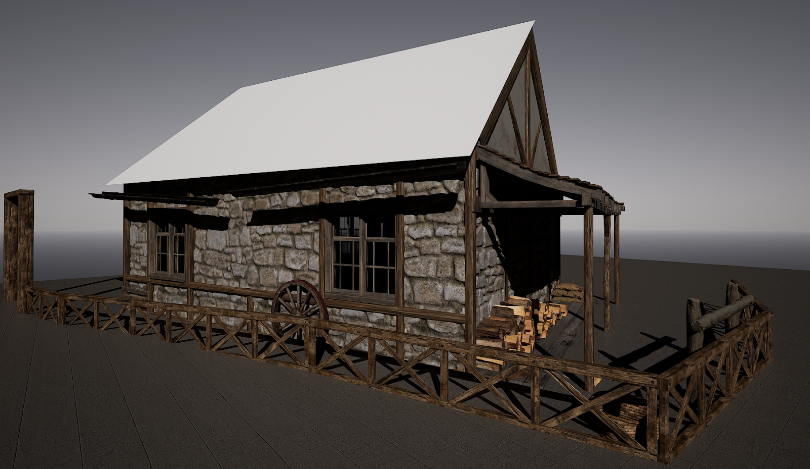

It is important to note that for the tiles to be generated correctly, the roof ridge must be at the
top. The Y axis must point upwards, as in the image below.

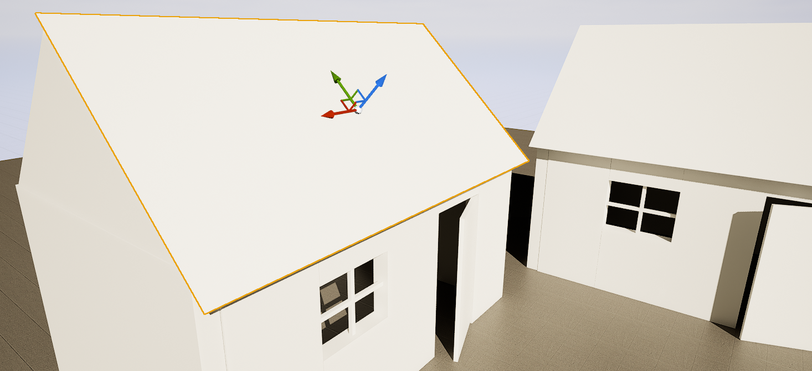

---

Next, we need to switch the generator setting to “Custom geometry”, since we want to specify
custom geometry for our generator.

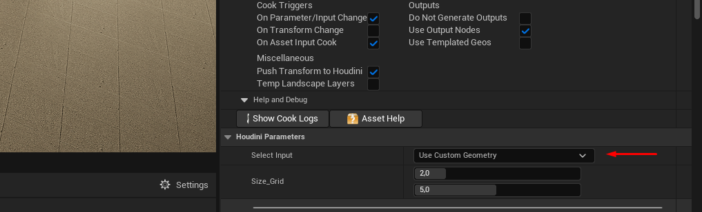

Next, in the “Houdini inputs” tab, you need to select “World inputs” from the list, instead of the
default “Geometry input”.

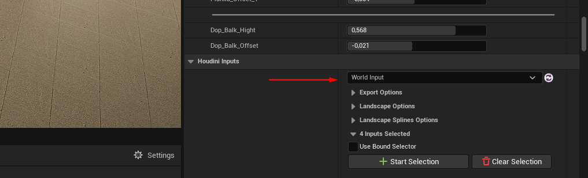

---

After that, we can select surfaces for roof generation in the same tab by clicking on the “Start
Selection” button, then select them in the viewport. For convenience, you can select several roof
surfaces at once using the SHIFT button.

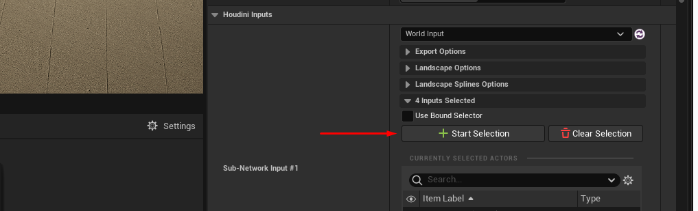

After you have selected the roofs, our Start Selection button will change its name to “Use
Current”, which means use the current selection. Click on it and wait until our Roof generator
finishes its work.

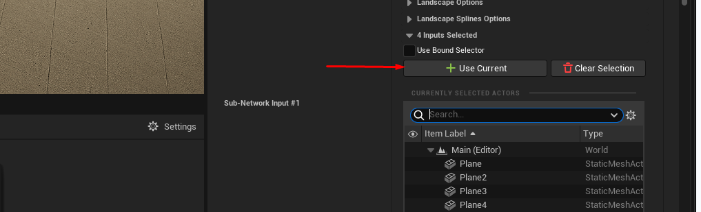

The generation time, if you select 3-5 surfaces, is approximately 3-5 seconds. If you select
many more surfaces, the waiting time will increase.

## Results

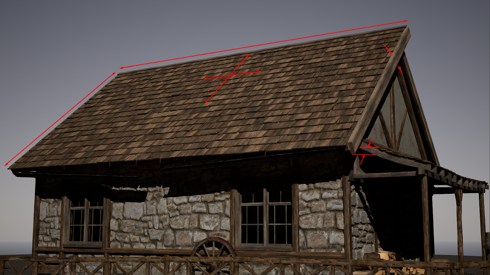

This is what the basic generation of our tool looks like. Then you can customize the appearance
of the roof to your taste using the Roof generator settings that regulate the length, width of the
tiles, the number of slabs, the thickness of the ridge, the length of the roof slope overhang, the
thickness, length and position of the support beams, the randomness (seed) of the slabs, the
ability to turn on or off some parameters.
Each time, after you change any of the parameters, you need to wait a few seconds so that our
generator can apply your changes.
After the required roof configuration is selected, do not forget to click the “BAKE” button to fix
the result.

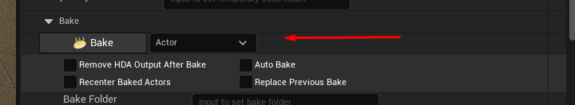

